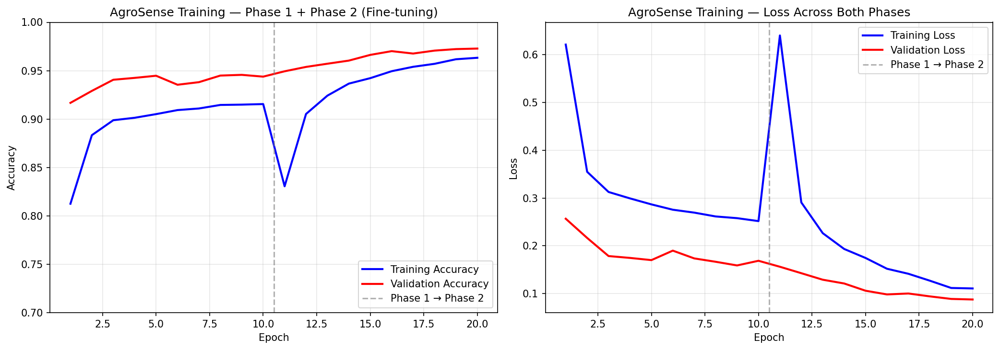
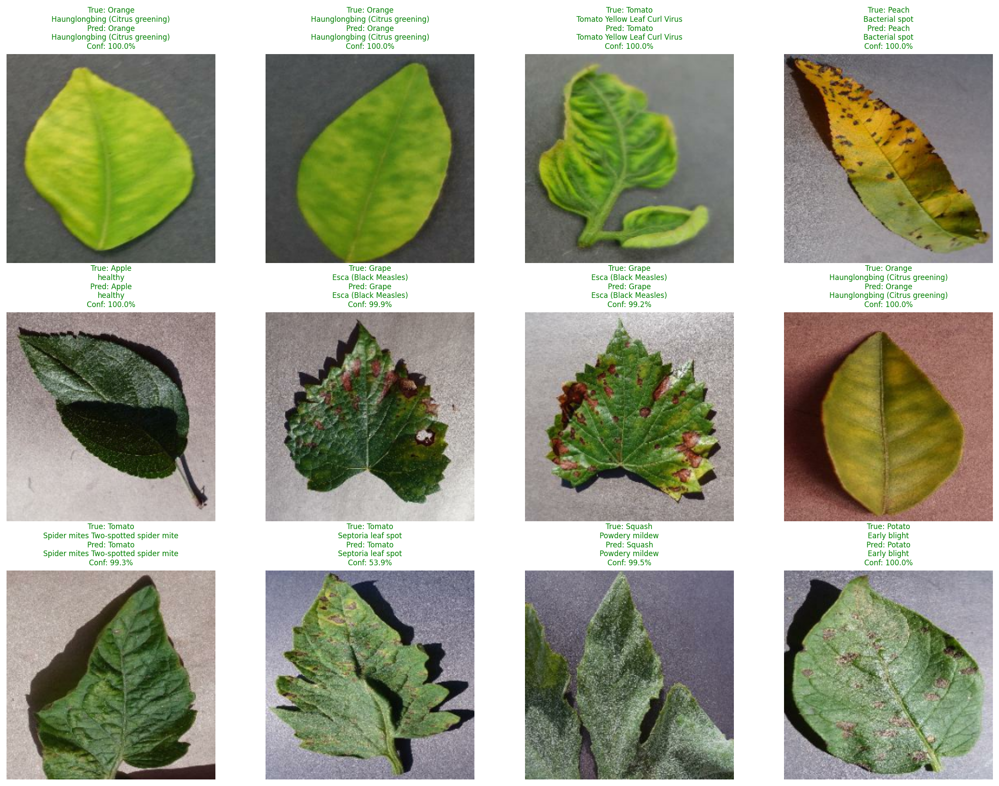

# 🌱 AgroSense

> AI-powered crop disease detection for smallholder farmers in West Africa.

A farmer photographs a diseased plant. Within seconds, an AI model identifies the disease and recommends treatment — in English or Twi, on a smartphone or even a basic feature phone via SMS.

**Status:** 🚧 In active development · Week 1 of 8 complete

---

## 🎯 The problem

- **2.2 million** smallholder farmers in Ghana
- **20–40%** of crops lost annually to preventable diseases
- **1 extension officer** per 1,500+ farmers — expert advice doesn't reach the farm
- **No existing app** does AI disease diagnosis for Ghanaian crop varieties

AgroSense closes that gap.

---

## 🧠 The ML model — Week 1 deliverable

Trained a **MobileNetV2** transfer-learning classifier on the **PlantVillage dataset** (54,305 images, 38 disease classes across 14 crops).

### Results

| Metric | Value |
|---|---|
| **Validation accuracy** | **97.28%** |
| **Validation loss** | 0.0875 |
| **Final model size (TFLite)** | 2.7 MB |
| **Training time** | ~50 minutes (Kaggle P100) |

### Two-phase training approach

**Phase 1 — Head training (epochs 1–10):** Frozen MobileNetV2 base, train only the custom classification head with learning_rate=1e-3. Reaches 94.6% validation accuracy.

**Phase 2 — Fine-tuning (epochs 11–20):** Unfreeze top 30 layers of base model, drop learning rate to 1e-5 (100× smaller). Reaches 97.3% validation accuracy.

The visible discontinuity at epoch 11 is the *fine-tuning shock* — a brief spike in training loss as previously-frozen layers receive gradients for the first time. The small learning rate keeps it survivable, and the model recovers within an epoch.

### Sample predictions

12-image smoke test on validation data the model has never trained on. **All 12 correct.** Most predictions at 99-100% confidence; one at 53.9% on a visually ambiguous tomato Septoria spot — appropriate uncertainty on a difficult case.

---

## 🛠️ Tech stack

### ML pipeline (Week 1) ✅
- **Training:** TensorFlow 2.19 / Keras (Kaggle Notebooks · P100 GPU)
- **Architecture:** MobileNetV2 (transfer learning from ImageNet) + custom classification head
- **Augmentation:** Random flip, rotation, zoom
- **Deployment format:** TFLite with default quantization (3.6× smaller, negligible accuracy loss)

### Coming in weeks 2-8
- **Backend:** Python + FastAPI · PostgreSQL 16 · Redis · Celery
- **AI text generation:** Google Gemini 1.5 Flash for treatment advice
- **Storage:** Cloudflare R2 for crop photos
- **SMS gateway:** Twilio (for farmers without smartphones)
- **Mobile:** React Native + Expo · Zustand · React Query
- **Deployment:** Railway (backend) · Expo EAS (Android APK)

---

## 📁 Project structure

agrosense/
- backend/ml/crop_disease_model.tflite — trained model (2.7 MB)
- backend/ml/class_names.json — 38 class labels
- notebooks/training_curves_combined.png
- notebooks/predictions_sample.png
- README.md

The backend/, mobile/, and supporting infrastructure will be built out in weeks 2–8.

---

## 🗺️ Roadmap

- [x] **Week 1** — ML model training & TFLite export
- [ ] **Week 2** — FastAPI backend foundation, database schema, auth
- [ ] **Week 3** — Diagnosis engine with Gemini treatment advice
- [ ] **Week 4** — Market prices, weather, Twilio SMS gateway, admin endpoints
- [ ] **Week 5** — Mobile app foundation (Expo, auth, navigation)
- [ ] **Week 6** — Mobile diagnosis screens (camera + result display)
- [ ] **Week 7** — Prices/weather screens, offline support, real user testing
- [ ] **Week 8** — Deployment, demo, portfolio launch

---

## 📊 Dataset

**PlantVillage** — public dataset of 54,305 labeled crop disease images across 38 classes (14 crops). Available on [Kaggle](https://www.kaggle.com/datasets/abdallahalidev/plantvillage-dataset).

For Ghana-specific crops missing from PlantVillage, future work will incorporate:
- **iCassava dataset** for cassava diseases
- **IITA datasets** for plantain/banana black sigatoka

---

## 👤 Author

**Ramsey Opoku Gyimah** ([@aimlin9](https://github.com/aimlin9))
3rd-year Computer Science student · Ghana

Building AgroSense as Startup 1 of 3 in an 8-month learning sprint.

---

## 📜 License

To be added.

---

> *"Diagnose. Treat. Harvest. Repeat."*